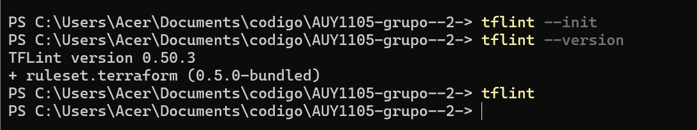
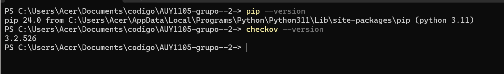
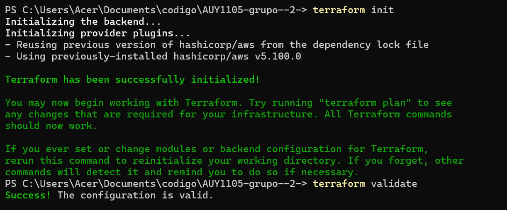
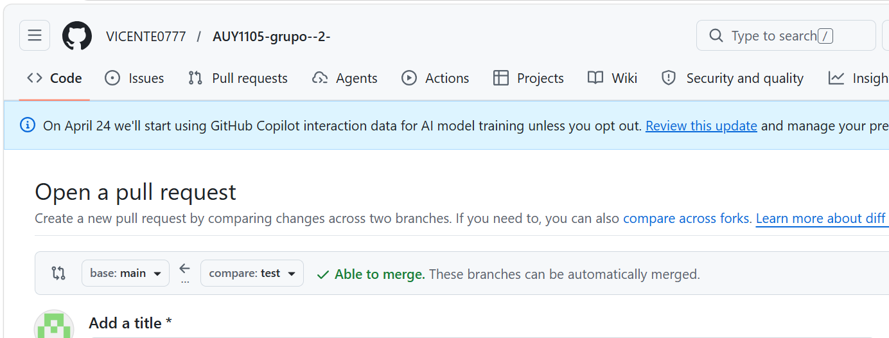
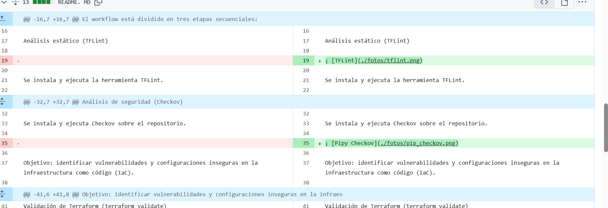
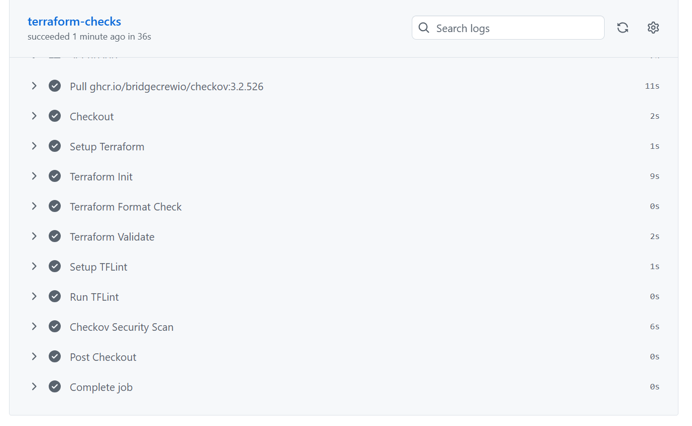
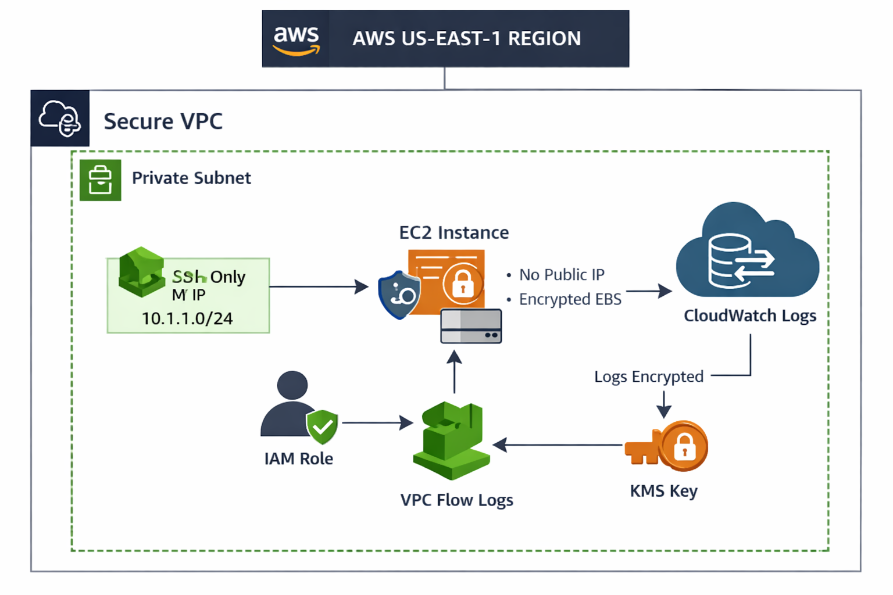

README EVALUACION CODIGO II

🚀 Workflow de Automatización con GitHub Actions

Este proyecto incluye un workflow de integración continua (CI) diseñado para garantizar la calidad y seguridad del código de infraestructura Terraform. El workflow se encuentra en .github/workflows/terraformci.yml y se ejecuta automáticamente en cada pull request hacia la rama main.

🔄 Flujo de Ejecución

El workflow está dividido en tres etapas secuenciales:

Análisis estático (TFLint)

Se instala y ejecuta la herramienta TFLint.

Objetivo: detectar errores de sintaxis, malas prácticas y configuraciones no recomendadas en el código Terraform.

Análisis de seguridad (Checkov)

Se instala y ejecuta Checkov sobre el repositorio.

Objetivo: identificar vulnerabilidades y configuraciones inseguras en la infraestructura como código (IaC).

Validación de Terraform (terraform validate)

Se ejecuta el comando terraform validate.

Objetivo: comprobar que la sintaxis y la configuración del código Terraform sean correctas y compatibles con el proveedor.

⚙️ Condiciones de ejecución

El workflow solo se activa en pull requests hacia la rama main.

Cada etapa debe completarse correctamente antes de pasar a la siguiente.

Si alguna etapa falla, el pull request no podrá ser aprobado hasta que se corrijan los errores.

✅ Beneficios

Garantiza que el código cumpla con estándares de calidad.

Previene configuraciones inseguras en la infraestructura.

Automatiza la validación, reduciendo errores humanos.

Facilita la colaboración y revisión de código en equipo.

EXPLICACION main.tf

Este código de infraestructura define los recursos básicos en AWS para el proyecto AUY1105-grupo--2-:

Proveedor AWS: Se configura con la última versión mayor estable (~> 5.0).

VPC: Red privada con bloque CIDR 10.1.0.0/16.

Subred pública: Dentro de la VPC, con rango 10.1.1.0/24.

Security Group: Permite únicamente tráfico entrante por SSH (puerto 22) desde una IP específica.

Instancia EC2: Máquina virtual con Ubuntu 24.04 LTS, tipo t2.micro, asociada a la subred y al security group.

definición main.tf 

Red privada con controles estrictos.

Logs cifrados y retenidos.

Roles IAM con privilegios mínimos.

EC2 sin exposición pública y con cifrado.

Es un diseño pensado para pasar validaciones de seguridad (TFLint, Checkov) y demostrar buenas prácticas de DevOps en AWS.

